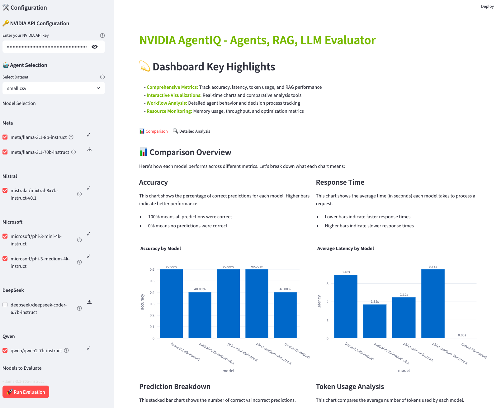
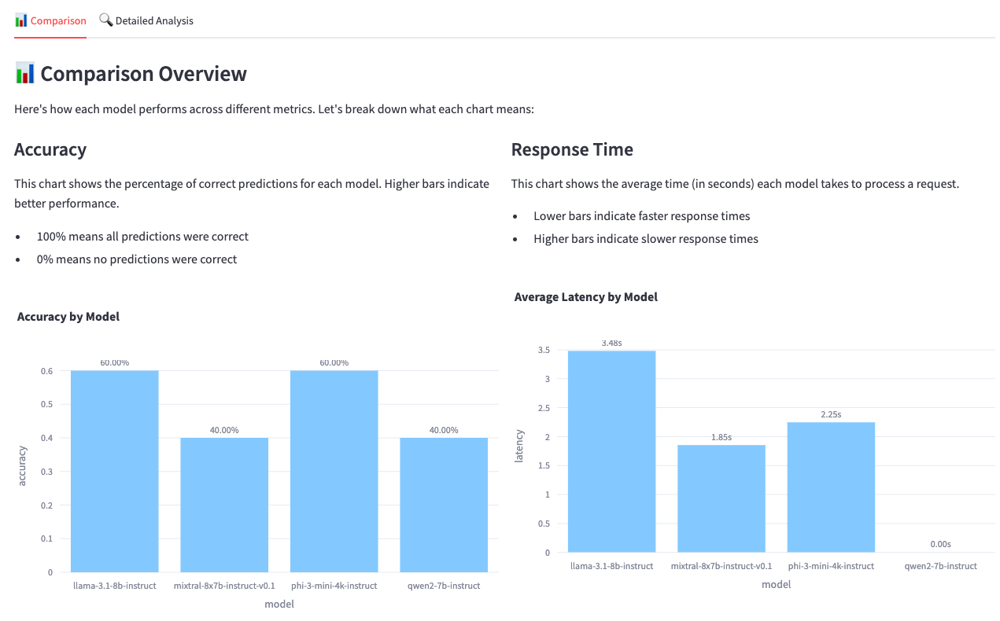
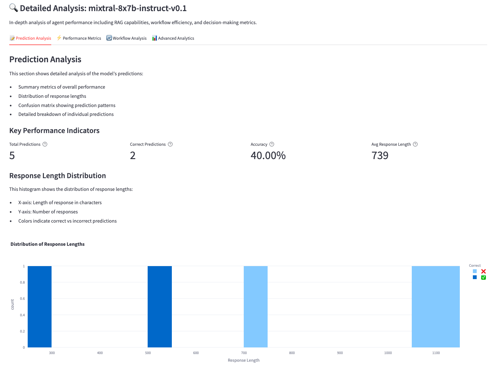
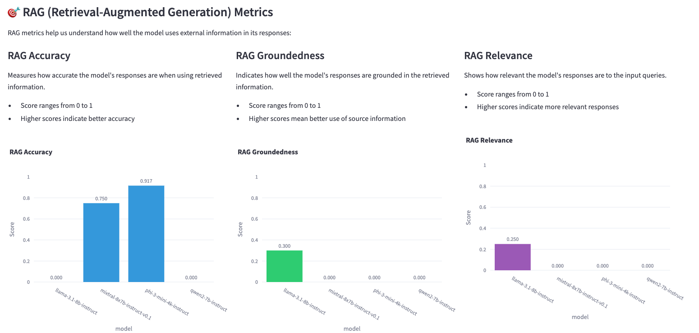
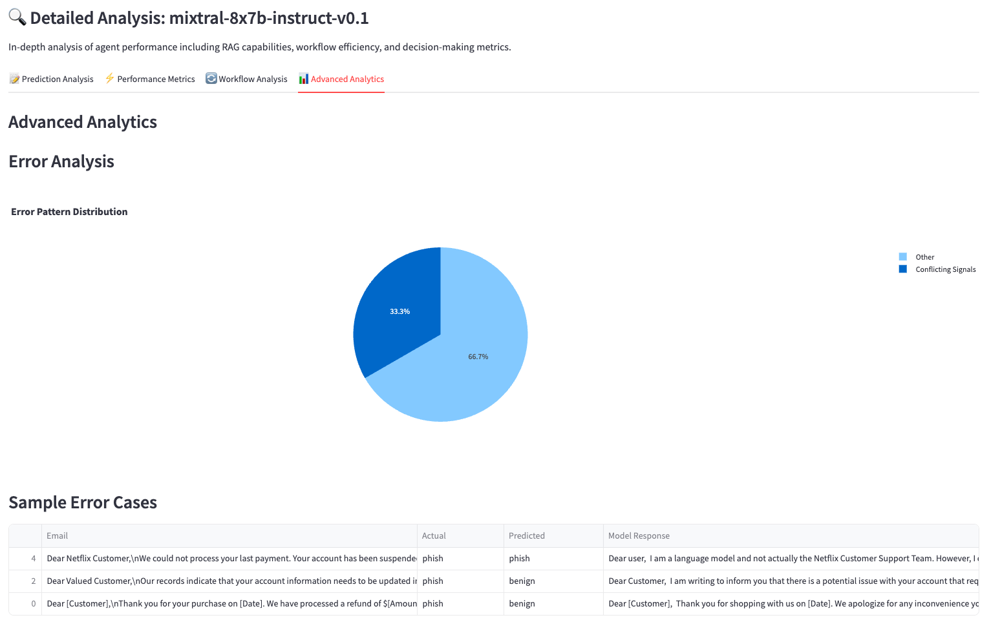

# NVIDIA AgentIQ Agents Evaluator

A comprehensive evaluation platform for AI agents powered by NVIDIA's AgentIQ framework. This dashboard enables detailed analysis and comparison of agent performance across multiple dimensions including RAG capabilities, workflow efficiency, and decision-making accuracy.

## 🌟 Key Features

- 🤖 **Advanced Agent Evaluation**
  - RAG (Retrieval-Augmented Generation) performance metrics
  - Multi-step reasoning assessment
  - Workflow efficiency analysis
  - Decision-making accuracy tracking

- 📊 **Interactive Dashboard**
  - Real-time evaluation monitoring
  - Comparative performance visualization
  - Detailed agent behavior analysis
  - Resource utilization insights

- 🔍 **Comprehensive Metrics**
  - Agent accuracy and reliability
  - Response quality assessment
  - Processing efficiency metrics
  - Resource optimization tracking

- 🛠 **Flexible Configuration**
  - Support for multiple agent architectures
  - Customizable evaluation scenarios
  - Extensible testing frameworks
  - Configurable performance thresholds

## 📊 Dashboard Examples

### Main Dashboard Interface

The main interface provides easy access to all evaluation features and real-time monitoring capabilities.

### Comparison Overview
The dashboard provides comprehensive model comparison across multiple metrics:

#### 1. Model Performance Comparison

Compare multiple models across key metrics:
- Accuracy rates across different models
- Response time analysis
- Token usage patterns
- Overall performance trends

#### 2. Detailed Analysis View

In-depth analysis of individual model performance including:
- Confusion matrix visualization
- Response length distribution
- Prediction breakdown
- Sample predictions and errors

### RAG Performance Metrics

Detailed analysis of Retrieval-Augmented Generation capabilities:

- **RAG Accuracy**: Measures how accurate the model's responses are when using retrieved information
- **RAG Groundedness**: Shows how well responses are grounded in the retrieved information
- **RAG Relevance**: Indicates how relevant the responses are to input queries

### Advanced Analytics

Comprehensive error analysis and performance insights:
- Error pattern distribution
- Sample error cases
- Performance optimization opportunities

### Key Performance Indicators
Key metrics tracked for each model:
- Total Predictions: Number of evaluations performed
- Correct Predictions: Accuracy count
- Accuracy Percentage: Success rate
- Average Response Length: Output size metrics
- Token Usage Statistics: Resource utilization
- Processing Time: Latency analysis

## 📋 Prerequisites

- Python 3.8+ (3.10+ recommended)
- NVIDIA AI Endpoints API key
- AgentIQ framework installation

## 🚀 Quick Start

### 1. Clone the Repository

```bash
git clone https://github.com/ahsanblock/NVIDIA-AgentIQ-Agents-Evaluator.git
cd NVIDIA-AgentIQ-Agents-Evaluator
```

### 2. Set Up Environment

```bash
# Create and activate virtual environment
python -m venv venv
source venv/bin/activate  # On Windows: venv\Scripts\activate

# Install dependencies
pip install -r requirements.txt
```

### 3. Install AgentIQ

#### Option A: Clone AgentIQ Repository (Recommended)

```bash
# Clone AgentIQ in adjacent directory
cd ..
git clone https://github.com/NVIDIA/AgentIQ.git
cd AgentIQ

# Install AgentIQ
python -m venv .venv
source .venv/bin/activate
pip install -e .

# Return to evaluator
cd ../NVIDIA-AgentIQ-Agents-Evaluator
```

#### Option B: Use Existing AgentIQ Installation

```bash
export AGENTIQ_PATH=/path/to/your/AgentIQ
```

### 4. Configure API Access

```bash
export NVIDIA_API_KEY=your-api-key-here
```

## 💻 Running the Dashboard

Start the evaluation dashboard:
```bash
streamlit run app.py
```

Access the dashboard at http://localhost:8501

## 📊 Evaluation Capabilities

### Agent Performance Metrics

- **RAG Capabilities**
  - Accuracy in information retrieval
  - Response groundedness
  - Context relevance
  - Source utilization

- **Workflow Efficiency**
  - Task completion rates
  - Processing time analysis
  - Resource utilization
  - Optimization metrics

- **Decision Making**
  - Response accuracy
  - Reasoning quality
  - Error handling
  - Edge case management

### Customization

Add your own evaluation scenarios using CSV files with the following structure:

```csv
body,label,subject
"Content to evaluate...",category,"Subject line"
```

## 🤝 Contributing

We welcome contributions! Please feel free to submit pull requests or open issues for improvements.

## 📜 License

This project is licensed under the Apache 2.0 License - see the LICENSE file for details.

## 🙏 Acknowledgments

- NVIDIA for providing the AgentIQ framework
- Contributors to the open-source AI community
- All developers and researchers advancing agent technology

---

<div align="center">
  <b>Powered by NVIDIA AgentIQ</b><br>
  <i>Advancing AI Agent Evaluation and Analysis</i>
</div> 